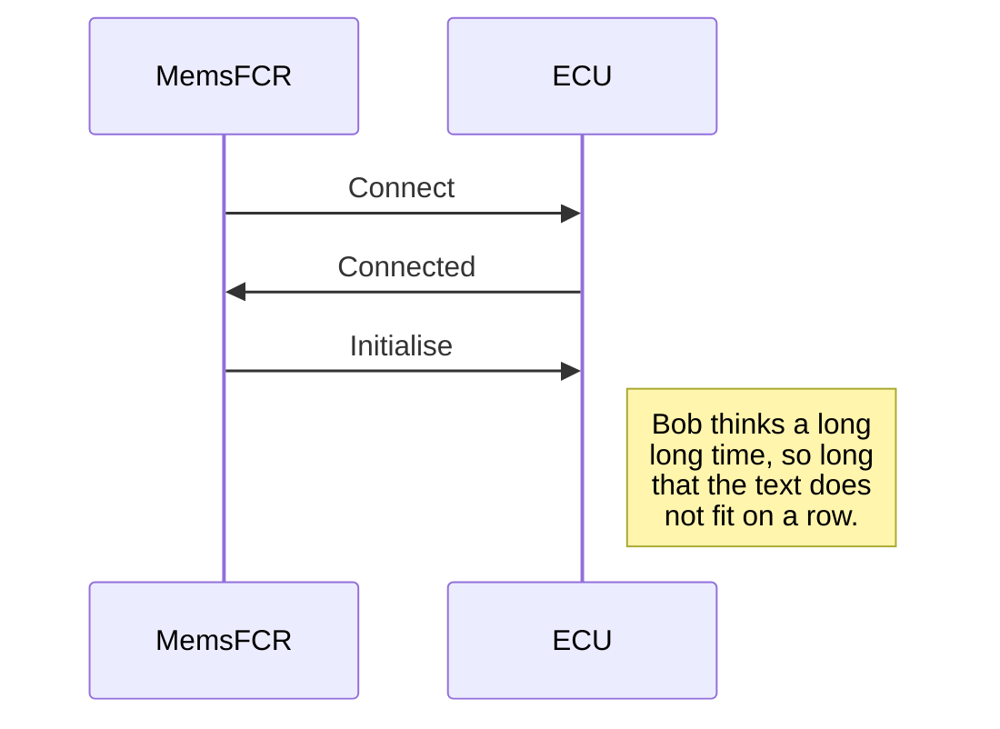
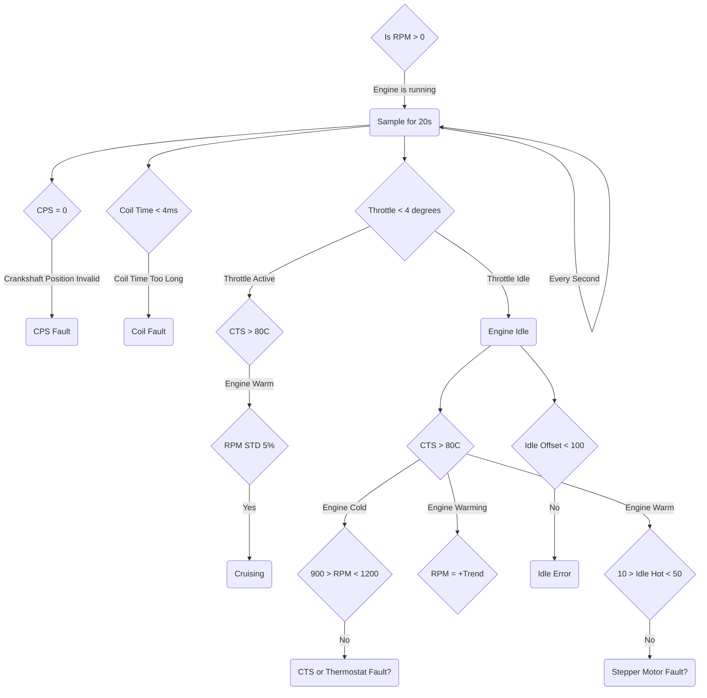

## Log File Format
| Column | Description | Calculation |
|--------|-------------|-------------|
| #time| event timestamp hh:mm:ss.sss ||
| 80x01-02_engine-rpm| engine rpm ||
| 80x03_coolant_temp| temperature in degrees Celsius read from the Coolant Temperature Sensor (CTS). This sensor can be found under the injector unit. An essential value in the air:fuel ratio calculation|value - 55|
| 80x04_ambient_temp| not used by the ECU, always returns 255| value - 55 = 200 |
| 80x05_intake_air_temp| temperature in degrees Celsius read from the Air Intake Temperature Sensor (ATS). This sensor can be found under the air filter. An essential value in the air:fuel ratio calculation|value - 55|
| 80x06_fuel_temp| not used by the ECU, always returns 255| value - 55 = 200 |
| 80x07_map_kpa| manifold absolute pressure (MAP). Reads pressure from back of the injector unit via the vacuum pipes and fuel trap. An essential value in the air:fuel ratio calculation | |
| 80x08_battery_voltage| the battery voltage. A figure <12 volts will cause running issues | value / 10 |
| 80x09_throttle_pot| |
| 80x0A_idle_switch| |
| 80x0B_uk1| |
| 80x0C_park_neutral_switch| |
| 80x0D-0E_fault_codes| |
| 80x0F_idle_set_point| |
| 80x10_idle_hot| |
| 80x11_uk2| |
| 80x12_iac_position| |
| 80x13-14_idle_error| |
| 80x15_ignition_advance_offset| |
| 80x16_ignition_advance| |
| 80x17-18_coil_time| |
| 80x19_crankshaft_position_sensor| |
| 80x1A_uk4| |
| 80x1B_uk5| |
| 7dx01_ignition_switch| |
| 7dx02_throttle_angle| |
| 7dx03_uk6| |
| 7dx04_air_fuel_ratio| |
| 7dx05_dtc2| |
| 7dx06_lambda_voltage| |
| 7dx07_lambda_sensor_frequency| |
| 7dx08_lambda_sensor_dutycycle| |
| 7dx09_lambda_sensor_status| |
| 7dx0A_closed_loop| |
| 7dx0B_long_term_fuel_trim| |
| 7dx0C_short_term_fuel_trim| |
| 7dx0D_carbon_canister_dutycycle| |
| 7dx0E_dtc3| |
| 7dx0F_idle_base_pos| |
| 7dx10_uk7| |
| 7dx11_dtc4| |
| 7dx12_ignition_advance2| |
| 7dx13_idle_speed_offset| |
| 7dx14_idle_error2| |
| 7dx14-15_uk10| |
| 7dx16_dtc5| |
| 7dx17_uk11| |
| 7dx18_uk12| |
| 7dx19_uk13| |
| 7dx1A_uk14| |
| 7dx1B_uk15| |
| 7dx1C_uk16| |
| 7dx1D_uk17| |
| 7dx1E_uk18| |
| 7dx1F_uk19| |
| 0x7d_raw| |
| 0x80_raw| |
| engine_running| |
| warming| |
| at_operating_temp| |
| engine_idle| |
| idle_fault| |
| idle_speed_fault| |
| idle_error_fault| |
| idle_hot_fault| |
| cruising| |
| closed_loop| |
| closed_loop_expected| |
| closed_loop_fault| |
| throttle_active| |
| map_fault| |
| vacuum_fault| |
| iac_fault| |
| iac_range_fault| |
| iac_jack_fault| |
| o2_system_fault| |
| lambda_range_fault| |
| lambda_oscillation_fault| |
| thermostat_fault| |
| crankshaft_sensor_fault| |
| coil_fault| |

## ROSCO Protocol
| 0x7d | Description | ECU Value |
|------|-------------------------------|-----------------------------|
| 0x00 | Size of data frame, including this byte | |
| 0x01 | Unknown | |
| 0x02 | Throttle angle? | |
| 0x03 | Unknown | |
| 0x04 | Sometimes documented to be air/fuel ratio, but often observed to never change from | 0xFF | |
| 0x05 | Unknown | |
| 0x06 | Lambda sensor voltage, 0.5mv per LSB | |
| 0x07 | Lambda sensor frequency? | |
| 0x08 | Lambda sensor duty cycle? | |
| 0x09 | Lambda sensor status? | 0x01 for good, any other value for no good | |
| 0x0A | Loop indicator, 0 for open loop and nonzero for closed loop | |
| 0x0B | Long term trim? | |
| 0x0C | Short term trim, 1% per LSB | |
| 0x0D | Carbon canister purge valve duty cycle? | |
| 0x0E | Unknown | |
| 0x0F | Idle base position | |
| 0x10 | Unknown | |
| 0x11 | Unknown | |
| 0x12 | Unknown | |
| 0x13 | Unknown | |
| 0x14 | Idle error? | |
| 0x15 | Unknown | |
| 0x16 | Unknown | |
| 0x17 | Unknown | |
| 0x18 | Unknown | |
| 0x19 | Unknown | |
| 0x1A | Unknown | |
| 0x1B | Unknown | |
| 0x1C | Unknown | |
| 0x1D | Unknown | |
| 0x1E | Unknown | |
| 0x1F | Unknown | |

| 0x80 | Description | ECU Value |
|------|-------------------------------|-----------------------------|
| 0x00 | Size of data frame, including this byte | |
| 0x01 | Unknown | |
| 0x02 | Throttle angle? | |
| 0x03 | Unknown | |
| 0x04 | Sometimes documented to be air/fuel ratio, but often observed to never change from | 0xFF | |
| 0x05 | Unknown | |
| 0x06 | Lambda sensor voltage, 0.5mv per LSB | |
| 0x07 | Lambda sensor frequency? | |
| 0x08 | Lambda sensor duty cycle? | |
| 0x09 | Lambda sensor status? | 0x01 for good, any other value for no good | |
| 0x0A | Loop indicator, 0 for open loop and nonzero for closed loop | |
| 0x0B | Long term trim? | |
| 0x0C | Short term trim, 1% per LSB | |
| 0x0D | Carbon canister purge valve duty cycle? | |
| 0x0E | Unknown | |
| 0x0F | Idle base position | |
| 0x10 | Unknown | |
| 0x11 | Unknown | |
| 0x12 | Unknown | |
| 0x13 | Unknown | |
| 0x14 | Idle error? | |
| 0x15 | Unknown | |
| 0x16 | Unknown | |
| 0x17 | Unknown | |
| 0x18 | Unknown | |
| 0x19 | Unknown | |
| 0x1A | Unknown | |
| 0x1B | Unknown | |
| 0x1C | Unknown | |
| 0x1D | Unknown | |
| 0x1E | Unknown | |
| 0x1F | Unknown | |
