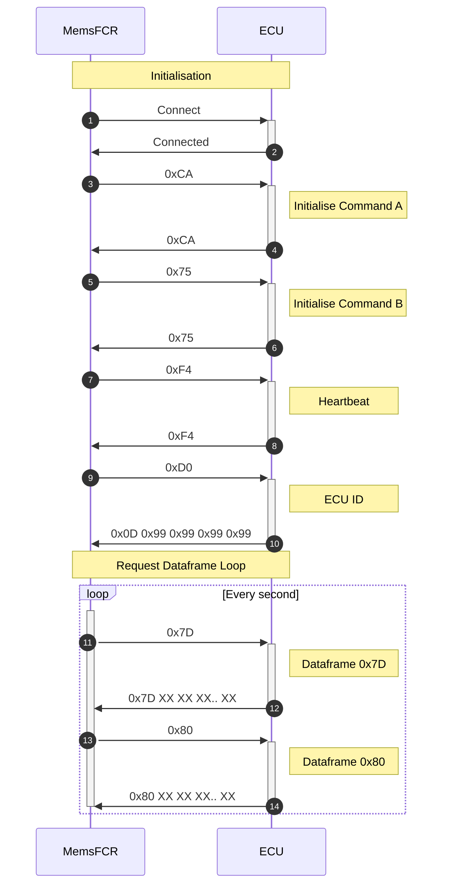
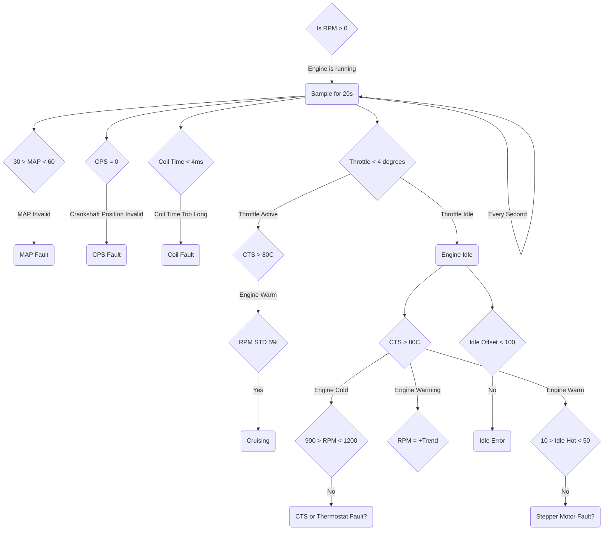
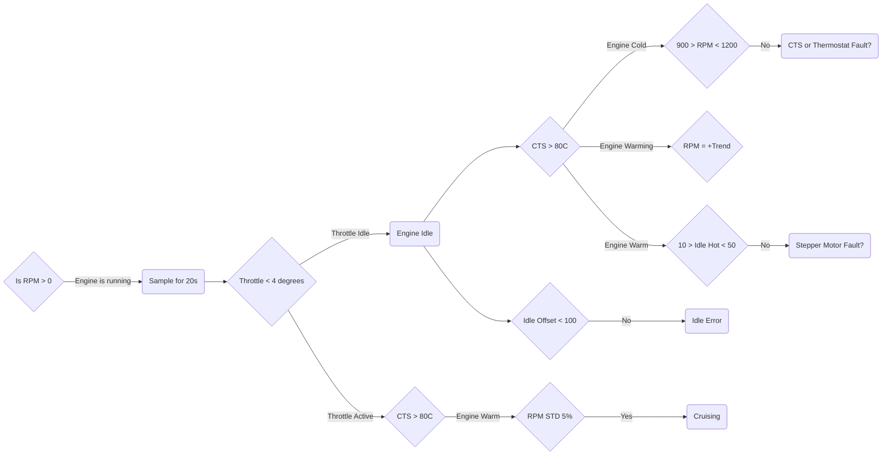
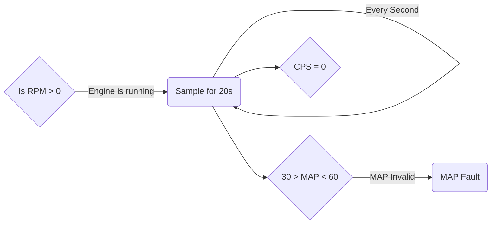

## MemsFCR / ECU Communication Sequence

## MemsFCR Diagnostics Analysis Tree

## Idle Speed Diagnostic Tree

## O2 System Diagnostic Tree

## MemsFCR Log File Format and Applied Calculations to Raw Data
| Column | Description | Calculation Applied |
|--------|-------------|-------------|
| #time| event timestamp hh:mm:ss.sss ||
| 80x01-02_engine-rpm| engine rpm ||
| 80x03_coolant_temp| temperature in degrees Celsius read from the Coolant Temperature Sensor (CTS). This sensor can be found under the injector unit. An essential value in the air:fuel ratio calculation|value - 55|
| 80x04_ambient_temp| not used by the ECU, always returns 255| value - 55 = 200 |
| 80x05_intake_air_temp| temperature in degrees Celsius read from the Air Intake Temperature Sensor (ATS). This sensor can be found under the air filter. An essential value in the air:fuel ratio calculation|value - 55|
| 80x06_fuel_temp| not used by the ECU, always returns 255| value - 55 = 200 |
| 80x07_map_kpa| manifold absolute pressure (MAP). Reads pressure from back of the injector unit via the vacuum pipes and fuel trap. An essential value in the air:fuel ratio calculation | |
| 80x08_battery_voltage| the battery voltage. A figure <12 volts will cause running issues | value / 10 |
| 80x09_throttle_pot| throttle potentiometer position. used by the ECU do determine throttle position when controlling idle speed|value * 0.02
| 80x0A_idle_switch| shows the state of the throttle switch, fitted on early vehicles. On systems without an actual throttle switch the value shown indicates whether the MEMS ECU has calculated that the throttle is closed by using the throttle position sensor. If the switch shows 'ON' when the throttle is closed, then the vehicle will not idle correctly and the closed throttle position may need to be reset. This procedure is performed by fully depressing and releasing the accelerator pedal 5 times within 10 or less seconds of turning on the ignition and then waiting 20 seconds. ||
| 80x0B_uk1| unknown value ||
| 80x0C_park_neutral_switch| used on vehicles with an automatic gearbox | true / false |
| 80x0D-0E_fault_codes| ECU fault codes: Coolant temp sensor fault (Code 1) Inlet air temp sensor fault (Code 2) Fuel pump circuit fault (Code 10) Throttle pot circuit fault (Code 16) | |
| 80x0F_idle_set_point| adjusts the idle rpm by the value shown. Adjusting idle speed will modify this value | |
| 80x10_idle_hot| the number of IACV steps from fully closed (0) which the ECU has learned as the correct position to maintain the target idle speed with a fully warmed up engine. If this value is outside the range 10 - 50 steps, then this is an indication of a possible fault condition or poor adjustment. | value - 35 |
| 80x11_uk2| unknown value ||
| 80x12_iac_position| Inlet Air Control valve (IACV) position (relates to expected Stepper Motor position)  ||
| 80x13-14_idle_error| idle speed offset (also known as idle speed deviation)||
| 80x15_ignition_advance_offset| adjustment to the ignition timing ||
| 80x16_ignition_advance| ignition advance, value of 128 = 0 | (value / 2) - 24 |
| 80x17-18_coil_time| coil timing in ms | value * 0.002 |
| 80x19_crankshaft_position_sensor| position of the crankshaft from the position sensor (CPS) ||
| 80x1A_uk4| unknown value ||
| 80x1B_uk5| unknown value ||
| 7dx01_ignition_switch| status of the ignition switch | true / false |
| 7dx02_throttle_angle| shows the position of the throttle disc obtained from the MEMS ECU using the throttle potentiometer. This value should change from a low value to a high value as the throttle pedal is depressed. | value * 6 / 10 |
| 7dx03_uk6| unknown value ||
| 7dx04_air_fuel_ratio| the current air:fuel ratio | value / 10 |
| 7dx05_dtc2| diagnostic trouble code - unknown codes ||
| 7dx06_lambda_voltage| the voltage read from the lambda sensor | value * 5 |
| 7dx07_lambda_sensor_frequency| not used by the ECU, value reads 255 ||
| 7dx08_lambda_sensor_dutycycle| not used by the ECU, value reads 255 ||
| 7dx09_lambda_sensor_status| ECU O2 circuit status, 1 active  ||
| 7dx0A_closed_loop| ECU has entered closed loop and uses the lambda sensor for determining air:fuel ratio ||
| 7dx0B_long_term_fuel_trim| long term fuel trim (LTFT) displays ECU value to adjust fuelling. value of 128 = 0 | value - 128 |
| 7dx0C_short_term_fuel_trim| short term fuel trim (STFT) displays ECU value to adjust fuelling |  |
| 7dx0D_carbon_canister_dutycycle| not used by ECU, value reads 0 | |
| 7dx0E_dtc3| diagnostic trouble code - unknown codes ||
| 7dx0F_idle_base_pos| the base value to offset idle position from ||
| 7dx10_uk7| unknown value ||
| 7dx11_dtc4| diagnostic trouble code - unknown codes ||
| 7dx12_ignition_advance2| ignition advance | value - 48 |
| 7dx13_idle_speed_offset| idle speed offset used to adjust idle speed ||
| 7dx14_idle_error2| idle error ||
| 7dx14-15_uk10| unknown value ||
| 7dx16_dtc5| diagnostic trouble code - unknown codes ||
| 7dx17_uk11| unknown value ||
| 7dx18_uk12| unknown value ||
| 7dx19_uk13| unknown value ||
| 7dx1A_uk14| unknown value ||
| 7dx1B_uk15| unknown value ||
| 7dx1C_uk16| unknown value ||
| 7dx1D_uk17| unknown value ||
| 7dx1E_uk18| unknown value ||
| 7dx1F_uk19| unknown value ||
| 0x7d_raw| hexadecimal response from the ECU for command 0x7D |
| 0x80_raw| hexadecimal response from the ECU for command 0x80 |
| engine_running| engine is running | true / false |
| warming| engine is warming up to operating temperature | true / false |
| at_operating_temp| engine is at operating temperature | true / false |
| engine_idle| engine is idle | true / false |
| idle_fault| hot or cold idle speed or idle offset is outside expected parameters | true / false |
| idle_speed_fault| cold idle speed is outside expected parameters | true / false |
| idle_error_fault| idle offset is outside expected parameters | true / false |
| idle_hot_fault| hot idle speed is outside expected parameters | true / false |
| cruising| rpm is stable but not idle; engine is cruising (differentiates from idle) | true / false |
| closed_loop| ECU is operating in closed loop (using lambda to determine air:fuel ratio) | true / false |
| closed_loop_expected| expecting the ECU to be in closed loop | true / false |
| closed_loop_fault| closed loop fault | true / false |
| throttle_active| the throttle pedal is depressed | true / false |
| map_fault| MAP readings is outside expected parameters | true / false |
| vacuum_fault| MAP and Air:Fuel ratio are outside expected parameters indicating a possible vacuum pipe fault | true / false |
| iac_fault| IAC position invalid if the idle offset exceeds the max error, yet the IAC Position remains at 0  | true / false |
| iac_range_fault| IAC readings outside expected parameters | true / false |
| iac_jack_fault| high jack count indicating possible problem with the stepper motor, throttle cable adjustment or the throttle pot| true / false |
| o2_system_fault| detected a potential o2 system fault | true / false |
| lambda_range_fault| lambda sensor readings are outside expected parameters| true / false |
| lambda_oscillation_fault| lambda sensor not oscillating as expected | true / false |
| thermostat_fault| coolant temperature changes over time indicate thermostat fault (could also be a CPS fault) | true / false |
| crankshaft_sensor_fault| crankshaft position sensor (CPS) reading is outside expected parameters | true / false |
| coil_fault| coil is outside expected parameters | true / false |
